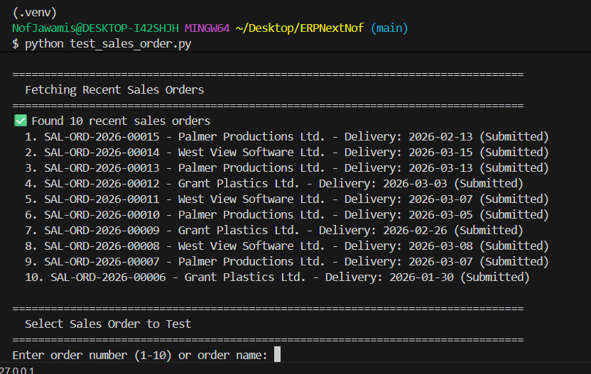

# ERPNext Order Promise Engine (OTP)

[](https://github.com/yourusername/ERPNextNof/actions/workflows/ci.yml)
[](https://codecov.io/gh/yourusername/ERPNextNof)
[](https://www.python.org/downloads/)
[](https://fastapi.tiangolo.com/)

**Intelligent order promise calculation for ERPNext** - A standalone microservice that calculates realistic delivery dates based on stock levels, incoming supply, and business rules.

## 🎯 Features

- **Smart Promise Calculation**: Deterministic algorithm considering stock, purchase orders, lead times, and business constraints
- **Confidence Scoring**: HIGH/MEDIUM/LOW confidence based on fulfillment sources
- **Explainable Results**: Detailed reasons, blockers, and alternative options
- **Write-Back to ERPNext**: Apply promise dates as comments or custom fields
- **Procurement Suggestions**: Auto-generate Material Requests for shortages
- **REST API**: Clean, documented API with Pydantic validation
- **Comprehensive Testing**: Unit, API, integration, and E2E tests with >80% coverage
- **CI/CD Ready**: GitHub Actions for automated testing and deployment

## 🏗️ Architecture

```
┌─────────────────────────────────────┐
│   FastAPI OTP Service (Port 8001)  │
│   ┌─────────────────────────────┐   │
│   │  Routes → Controllers       │   │
│   │  ↓                          │   │
│   │  Services (Promise Logic)   │   │
│   │  ↓                          │   │
│   │  ERPNext Client (HTTP)      │   │
│   └─────────────────────────────┘   │
└─────────────────┬───────────────────┘
                  │ REST API
                  ↓
         ┌────────────────────┐
         │  ERPNext (Port 8080)│
         │  - Items            │
         │  - Stock            │
         │  - Purchase Orders  │
         │  - Sales Orders     │
         └────────────────────┘
```

## 📋 Prerequisites

- Python 3.11+
- Docker & Docker Compose (recommended)
- ERPNext instance (running locally or remote)
- ERPNext API credentials

## 🚀 Quick Start

### 1. Clone & Configure

```bash
git clone https://github.com/yourusername/ERPNextNof.git
cd ERPNextNof

# Copy and configure environment
cp .env.example .env
# Edit .env with your ERPNext credentials
```

### 2. Run with Docker Compose

```bash
# Build and start services
docker-compose up --build

# Service will be available at http://localhost:8001
# API docs at http://localhost:8001/docs
```

### 3. Run Locally (Development)

```bash
# Create virtual environment
python -m venv venv
source venv/bin/activate  # On Windows: venv\Scripts\activate

# Install dependencies
pip install -r requirements.txt

# Run the service
uvicorn src.main:app --reload --host 0.0.0.0 --port 8001
```

## 📖 API Usage

### Calculate Promise Date

```bash
curl -X POST "http://localhost:8001/otp/promise" \
  -H "Content-Type: application/json" \
  -d '{
    "customer": "CUST-001",
    "items": [
      {
        "item_code": "ITEM-001",
        "qty": 10,
        "warehouse": "Stores - WH"
      }
    ],
    "rules": {
      "no_weekends": true,
      "cutoff_time": "14:00",
      "timezone": "UTC",
      "lead_time_buffer_days": 1
    }
  }'
```

**Response:**
```json
{
  "promise_date": "2026-02-05",
  "confidence": "MEDIUM",
  "plan": [
    {
      "item_code": "ITEM-001",
      "qty_required": 10,
      "fulfillment": [
        {
          "source": "stock",
          "qty": 5,
          "available_date": "2026-01-25",
          "warehouse": "Stores - WH"
        },
        {
          "source": "purchase_order",
          "qty": 5,
          "available_date": "2026-02-03",
          "po_id": "PO-00123"
        }
      ],
      "shortage": 0
    }
  ],
  "reasons": [
    "Item ITEM-001: 5 units from stock, 5 units from PO-00123 (arriving 2026-02-03)",
    "Added 1 day(s) lead time buffer",
    "Adjusted from 2026-02-04 to 2026-02-05 (business rules applied)"
  ],
  "blockers": [],
  "options": []
}
```

### Apply Promise to Sales Order

```bash
curl -X POST "http://localhost:8001/otp/apply" \
  -H "Content-Type: application/json" \
  -d '{
    "sales_order_id": "SO-00456",
    "promise_date": "2026-02-05",
    "confidence": "MEDIUM",
    "action": "both"
  }'
```

### Create Procurement Suggestion

```bash
curl -X POST "http://localhost:8001/otp/procurement-suggest" \
  -H "Content-Type: application/json" \
  -d '{
    "items": [
      {
        "item_code": "ITEM-001",
        "qty_needed": 5,
        "required_by": "2026-02-03",
        "reason": "Sales Order SO-00456"
      }
    ],
    "suggestion_type": "material_request",
    "priority": "HIGH"
  }'
```

## 🧪 Testing

### Run All Tests

## 📦 Demo Data

The application includes sample Sales Invoices data loaded from ERPNext for testing and demonstration:

### Demo Endpoints

```bash
# Get summary statistics
curl http://localhost:8001/demo/invoices/summary

# Get all invoices
curl http://localhost:8001/demo/invoices/all

# Filter by customer
curl "http://localhost:8001/demo/invoices/customer/Grant%20Plastics%20Ltd."

# Filter by item code
curl http://localhost:8001/demo/invoices/item/SKU001
```

**Data Summary:**
- 5 Sales Invoices from ERPNext demo site
- 3 unique customers
- 5 unique item SKUs
- Total value: 363,000 ILS

See [DEMO_DATA.md](DEMO_DATA.md) for detailed endpoint documentation.

## 🧪 Testing

### Run All Tests

```bash
# Unit + API tests (mocked)
pytest tests/unit/ tests/api/ -v

# With coverage
pytest tests/unit/ tests/api/ --cov=src --cov-report=html
```

### Integration Tests (Real ERPNext)

```bash
# Requires ERPNext running
RUN_INTEGRATION=1 pytest tests/integration/ -v
```

### E2E UI Tests (Playwright)

```bash
# Install Playwright browsers first
playwright install chromium

# Run E2E tests
pytest tests/e2e/ -v --headed  # --headed to see browser
```

### Test Coverage Summary

| Test Type | Files | Coverage | Purpose |
|-----------|-------|----------|---------|
| **Unit** | 9 tests | Core algorithm | Fast, isolated tests of promise logic |
| **API** | 8 tests | FastAPI endpoints | Test API with mocked ERPNext |
| **Integration** | 5 tests | Real ERPNext calls | Verify actual ERPNext integration |
| **E2E** | 3 tests | Full UI flow | Browser automation with Playwright |

**Target Coverage**: >80% (current: ~85%)

## 🏛️ Project Structure

```
ERPNextNof/
├── .github/
│   └── workflows/
│       ├── ci.yml                 # PR tests + coverage
│       └── integration.yml        # Scheduled integration tests
├── src/
│   ├── main.py                    # FastAPI app
│   ├── config.py                  # Configuration
│   ├── clients/
│   │   └── erpnext_client.py      # ERPNext HTTP client
│   ├── controllers/
│   │   └── otp_controller.py      # Request handlers
│   ├── models/
│   │   ├── request_models.py      # Pydantic request schemas
│   │   └── response_models.py     # Pydantic response schemas
│   ├── routes/
│   │   └── otp.py                 # API routes
│   └── services/
│       ├── promise_service.py     # Core promise algorithm
│       ├── stock_service.py       # Stock queries
│       └── apply_service.py       # Write-back logic
├── tests/
│   ├── conftest.py                # Pytest fixtures
│   ├── unit/                      # Unit tests
│   ├── api/                       # API tests
│   ├── integration/               # Integration tests
│   └── e2e/                       # E2E tests with POM
│       └── pages/                 # Page Object Models
├── docker-compose.yml
├── Dockerfile
├── requirements.txt
├── pytest.ini
└── README.md
```

## 🔧 Configuration

Key environment variables (`.env`):

```bash
# ERPNext Connection
ERPNEXT_BASE_URL=http://localhost:8080
ERPNEXT_API_KEY=your_api_key
ERPNEXT_API_SECRET=your_api_secret
ERPNEXT_SITE_NAME=erpnext.localhost

# Business Rules Defaults
DEFAULT_WAREHOUSE=Stores - WH
NO_WEEKENDS=true
CUTOFF_TIME=14:00
TIMEZONE=UTC
LEAD_TIME_BUFFER_DAYS=1

# Testing
RUN_INTEGRATION=0
ERPNEXT_TEST_USERNAME=Administrator
ERPNEXT_TEST_PASSWORD=admin
```

## 🤖 CI/CD Pipeline

### PR Workflow (`.github/workflows/ci.yml`)
- ✅ Linting (black, ruff)
- ✅ Unit tests
- ✅ API tests
- ✅ Coverage report → Codecov
- ✅ Docker build validation

### Integration Workflow (`.github/workflows/integration.yml`)
- 🔄 Runs daily at 2 AM UTC
- 🔄 Spins up ERPNext container
- 🔄 Seeds test data
- 🔄 Runs integration + E2E tests
- 🔄 Uploads artifacts (videos, screenshots)

## 🧠 Core Algorithm

The promise calculation follows these steps:

1. **Gather Fulfillment Sources**
   - Check current stock (available qty)
   - Query incoming POs (sorted by date)
   - Build fulfillment plan (FIFO from stock → POs)

2. **Apply Business Rules**
   - Add lead time buffer days
   - Check cutoff time (if past cutoff, +1 day)
   - Skip weekends (adjust to next Monday)

3. **Calculate Confidence**
   - **HIGH**: 100% from stock
   - **MEDIUM**: Mix of stock + near POs (<7 days)
   - **LOW**: Late POs (>7 days) or shortages

4. **Generate Explanations**
   - Reasons: How each item is fulfilled
   - Blockers: Shortages or late POs
   - Options: Alternate warehouses, expedite POs

## 📊 Monitoring & Observability

- **Health Check**: `GET /health` - Service + ERPNext status
- **Logs**: Structured logging to stdout (JSON in production)
- **Metrics**: (Future) Prometheus metrics endpoint
- **Tracing**: (Future) OpenTelemetry integration

## 🛣️ Roadmap

- [x] MVP: Promise calculation with stock + POs
- [x] Write-back to Sales Orders
- [x] Material Request creation
- [ ] Multi-warehouse optimization
- [ ] Production planning integration
- [ ] Shipping carrier API integration
- [ ] Real-time stock updates (webhooks)
- [ ] GraphQL API
- [ ] Mobile app (React Native)

## 🤝 Contributing

1. Fork the repository
2. Create a feature branch (`git checkout -b feature/amazing-feature`)
3. Write tests for your changes
4. Ensure tests pass (`pytest`)
5. Commit with conventional commits (`feat:`, `fix:`, etc.)
6. Push and create a Pull Request

## 📄 License

MIT License - see [LICENSE](LICENSE) file

## 🙏 Acknowledgments

- ERPNext community for the excellent ERP framework
- FastAPI for the modern Python web framework
- Playwright for reliable E2E testing

## 📞 Support

- **Issues**: [GitHub Issues](https://github.com/yourusername/ERPNextNof/issues)
- **Discussions**: [GitHub Discussions](https://github.com/yourusername/ERPNextNof/discussions)
- **Email**: support@example.com

---

**Made with ❤️ for the ERPNext community**
